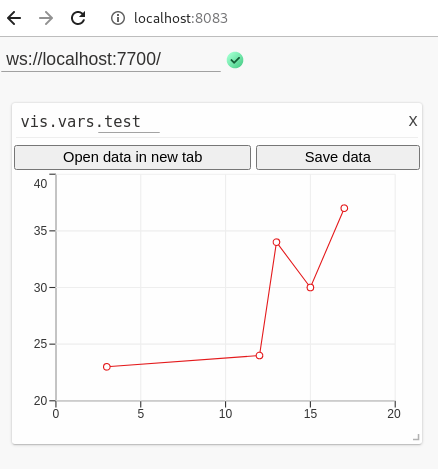
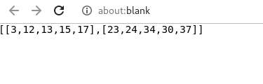

<div align="center">
    
</div>

This is a data_access_wrapper [libvis](http://libvis.dev) module

# Installation

`libvis-mods install gh:/libvis/data_access_wrapper`

# Usage

```python
from libvis.modules import data_access_wrapper
from libvis import Vis

vis = Vis()
test_data = [
    [3, 12, 13, 15, 17],
    [23, 24, 34, 30, 37]
]
vis.vars.test = data_access_wrapper(body=test_data)

```




Click on "Open data in new tab" to get the data.


